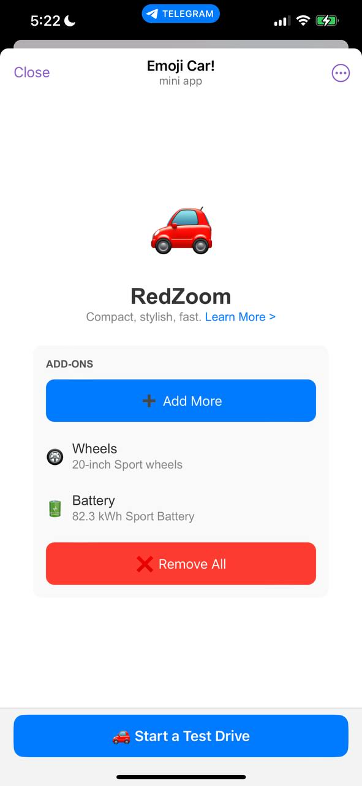

# 🚗 RedZoom Car Emoji Mini App Design



## Overview
A simple web app using **HTML**, **CSS**, and **JavaScript** to mimic the BlueZoom car emoji design. This project feels like a native app and is hosted on **GitHub Pages**.

[Original design](https://core.telegram.org/file/400780400851/2/6GwDkk6T-aY.416569/b591d589108b487d63)

I didn't bother implementing themes but it can easily be done. Check [ThemeParams](https://core.telegram.org/bots/webapps#themeparams)

## Features
- Pure **JS**, **CSS**, and **HTML** (no libraries)
- **Native-like** experience out of simplicity (no zooming, scrolling, or text selection)
- **Telegram WebApp SDK** integration
- Hosted on **GitHub Pages**

## Demo
Check the live demo hosted by Github pages 😎  
[Car Emoji](https://t.me/CarEmojiBot)

## How to Use
1. Clone or download the files.
2. Open `index.html` or use **GitHub Pages** for hosting.
3. Link the GitHub Pages URL to your **Telegram bot**.

## Project Structure
```bash
📦 BlueZoom Project
├── 📜 index.html
├── 📜 styles.css
├── 📜 script.js
└── 📜 README.md
```

## Update
I managed to create this page in 30 seconds, this stuff might be a game changer


